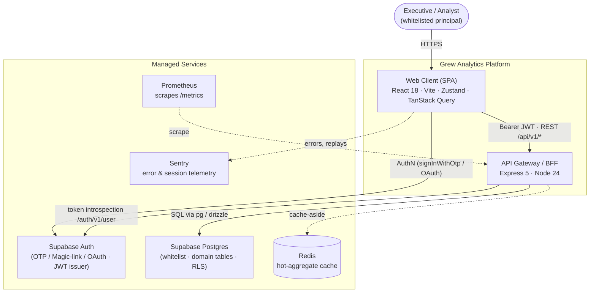
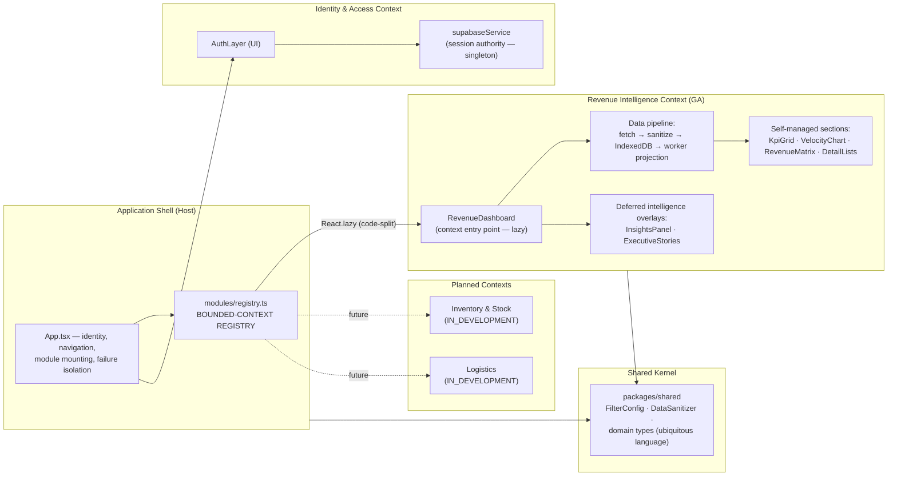
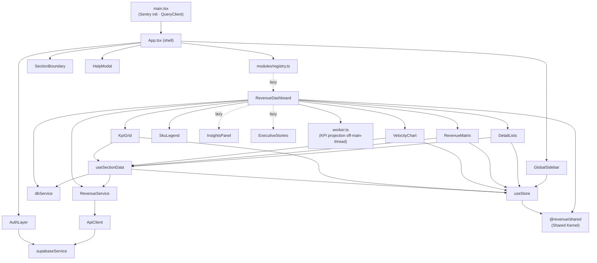
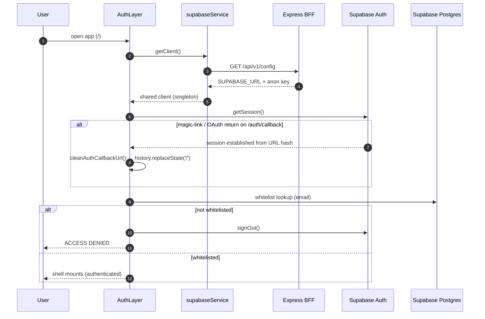
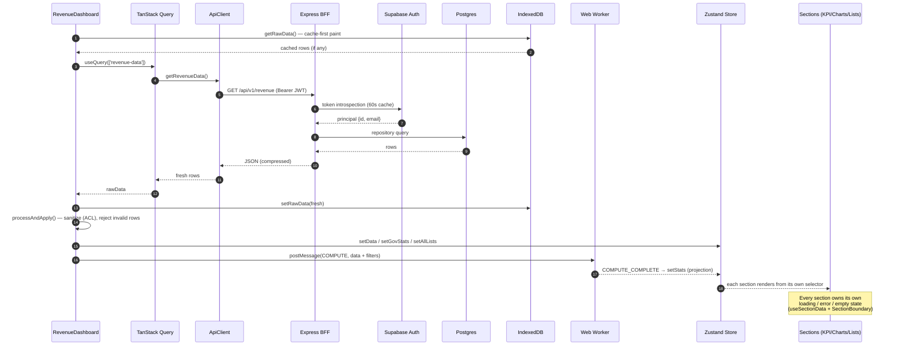

# Architecture Map — Grew Analytics Platform

> Living document. Reflects the codebase as of 2026-06-12, including the domain-isolation
> refactor (module registry, lazy bounded contexts, section bulkheads). Companion document:
> [Improvement_Roadmap.md](./Improvement_Roadmap.md).

---

## 1. System Context (C4 Level 1)

**Trust boundaries.** The browser is untrusted: every `/api/v1/*` request is authenticated by
token introspection at the BFF (60s positive cache). Supabase Postgres is the system of record;
Row-Level Security is the target enforcement layer for per-principal data access (roadmap §1).

---

## 2. Bounded Context Map (DDD, Level 2)

**Context rules**
- The shell owns *who* (identity) and *where* (navigation); contexts own *what* (domain logic, data, UI).
- A context is mounted only via its registry entry and is code-split — its bundle is fetched on activation.
- `packages/shared` is the **Shared Kernel**: domain types and the `DataSanitizer`
  **anti-corruption layer** that normalizes raw upstream rows before they enter the domain model.
- Cross-context communication happens only through the store's published interface and shared types —
  never by importing another context's internals.

---

## 3. Folder Responsibility Map

| Path | Layer (DDD) | Responsibility | May depend on |
|---|---|---|---|
| `apps/web/src/App.tsx` | Host shell | Identity lifecycle, navigation, module mounting, top-level bulkhead | registry, shared modules, services |
| `apps/web/src/modules/registry.ts` | Host shell | Bounded-context manifest; lazy entry points | React only |
| `apps/web/src/modules/auth/` | Identity & Access | Login UX, whitelist gate, session bootstrap | supabaseService, store |
| `apps/web/src/modules/revenue/` | Revenue context | Dashboard, sections, worker projection (CQRS-style read model) | services, store, shared kernel |
| `apps/web/src/modules/dashboard/` | Revenue context (intelligence) | Insights & stories overlays (deferred chunks) | store |
| `apps/web/src/modules/shared/` | Presentation kernel | Cross-context UI: sidebar, boundaries, placeholders, modals | store |
| `apps/web/src/services/` | Infrastructure (client) | `supabaseService` (session authority), `apiClient` (authenticated transport), `dbService` (IndexedDB), `cacheService` (localStorage) | external SDKs |
| `apps/web/src/store/` | Application state | Zustand store: filters, UI state, projections | shared kernel |
| `apps/web/src/hooks/` | Application services | `useSectionData` (per-section lifecycle), keyboard shortcuts | services, store |
| `apps/api/index.js` | API gateway | AuthN middleware, rate limiting, compression, SPA fallback, observability | routes, repositories |
| `apps/api/routes/` | Application layer (server) | HTTP contracts per context | repositories |
| `apps/api/repositories/` | Infrastructure (server) | Postgres access (drizzle/pg), connection lifecycle | database |
| `packages/shared/` | Shared Kernel | Ubiquitous-language types, sanitization, FY calendar logic | nothing (leaf) |
| `database/` | Infrastructure | Schema and migration assets | — |
| `monitoring/` | Observability | Structured logger, Prometheus metrics | — |
| `tests/e2e/` | Quality gates | Auth enforcement, domain isolation, regression specs | fixtures.js |
| `scripts/` | Operations | Data loaders (Python), one-off ETL | — |

**Dependency direction is one-way:** modules → hooks/services/store → shared kernel.
The shared kernel imports nothing; the shell imports contexts only through the registry.

---

## 4. Module Dependency Graph (client)

Build-time enforcement of this graph (vendor chunks, lazy context chunks) lives in
`apps/web/vite.config.ts`; the measured output is in §7.

---

## 5. Call Graphs (runtime sequences)

### 5.1 Authentication & session establishment

### 5.2 Revenue data pipeline (read-model projection)

A machine-generated, queryable call graph of the full codebase (286 nodes / 594 edges) is
available via the installed `graphify` tooling at `apps/graphify-out/graph.json`: query with
`python -m graphify explain "<symbol>"` or `python -m graphify path "A" "B"`; regenerate with
`python -m graphify update apps`.

---

## 6. Failure Isolation Model (bulkheads)

Every page section is responsible for **its own data, its own load, its own error, and its
own loading state**, enforced by two cooperating mechanisms:

| Failure mode | Owner | Behavior |
|---|---|---|
| Fetch in-flight | `useSectionData` per section | Section-local skeleton/spinner |
| Fetch failed | `useSectionData` + module-level `data-health-banner` | Section-local degraded card; banner offers Retry (refetch) |
| Render/runtime throw | `SectionBoundary` per section | Section swaps to fallback with Retry; siblings, shell, and navigation unaffected; exception reported to Sentry with a `section` tag |
| Module chunk fails / module crashes | Shell-level `SectionBoundary` around the lazy mount | Module area degrades; sidebar and identity survive |
| Auth service down | BFF returns 503 (fail-closed) | No data leaves the system without a verified principal |

Verified end-to-end by `tests/e2e/module_isolation.spec.js` (severed data feed, broken config
service → sections degrade in place, shell remains interactive).

---

## 7. Performance Budget & Current Numbers

Measured production build (2026-06-12, gzip):

| Chunk | Size (gz) | Loading |
|---|---|---|
| App shell (`index`) | 26.5 kB | Eager |
| `vendor-react` | 43.1 kB | Eager, long-lived cache |
| `vendor-supabase` | 54.6 kB | Eager (session bootstrap), long-lived cache |
| `vendor-observability` | 6.3 kB | Eager |
| `RevenueDashboard` (context) | 20.3 kB | **On activation (lazy)** |
| `vendor-charts` | 84.8 kB | **With Revenue context (lazy)** |
| `InsightsPanel` / `ExecutiveStories` | 1.7 / 2.2 kB | **Deferred post-paint** |
| Compute worker | 14.7 kB | Off main thread |

Prior state: one 511 kB (145 kB gz) monolithic chunk on the critical path.
Now: ~130 kB gz to interactive login; charts and domain code stream in per context.

Server: gzip responses (`compression`), per-request token introspection amortized by a
60s cache, git metadata cached 60s, graceful drain on SIGTERM, `PORT`/`HOST`/`CORS_ORIGINS`
twelve-factor configurable.

**Budgets to hold (CI gate candidates):** eager JS ≤ 150 kB gz · context chunk ≤ 100 kB gz ·
TTI on cold cache ≤ 3 s on mid-tier hardware · `/api/v1/revenue` p95 ≤ 800 ms.

---

## 8. Micro-Frontend Evolution Path

Current state is a **modular monolith with hard context seams** — the correct precursor. The
seams (registry + lazy chunks + one-way dependencies + shared kernel) are exactly the cut
lines for true micro-frontends when organizational scale demands them:

| Stage | Trigger | Mechanism |
|---|---|---|
| **Now — Modular monolith** | Single team | `MODULE_REGISTRY` + `React.lazy` chunks per context |
| **Next — Independent deployability** | Second team / second repo | Vite Module Federation (`@originjs/vite-plugin-federation`): each context builds & deploys its own remote; the shell consumes `remoteEntry.js` per registry entry |
| **Later — Independent runtimes** | Conflicting framework/release cadences | Import-map–based composition; shared kernel published as a versioned npm package; contract tests between shell and remotes |

Rule that makes all three stages cheap: **contexts never import each other's internals.**
That rule is already in force.

---

## 9. Production-Readiness Checklist

| Area | Status | Notes |
|---|---|---|
| AuthN at the gateway (token introspection, fail-closed) | ✅ | `authenticateJWT`, audit-logged |
| AuthZ (RLS, server-side whitelist) | 🔶 Backlog | Roadmap §1 — highest priority before GA |
| Audit trail | 🔶 Partial | Structured auth/access logs live; append-only `audit_log` table pending |
| Failure isolation (bulkheads) | ✅ | §6, e2e-verified |
| Code-split performance budget | ✅ | §7 |
| Compression, env-driven config | ✅ | Twelve-factor: `PORT`, `HOST`, `CORS_ORIGINS`, `VITE_SENTRY_DSN` |
| Hermetic test suite | ✅ | `PW_PORT` isolation; auth-enforcement + domain-isolation suites green |
| Legacy e2e specs (12) | 🔶 Migrate | Move to `fixtures.js` authenticated fixture + deterministic data seam |
| CSP | 🔶 Backlog | Blocked only by inline boot-loader script |
| Type safety in CI | ✅ | `tsc --noEmit` clean; gate it in CI |
| Secrets hygiene | 🔶 Verify | `.env` files present locally; ensure gitignored + `.env.example` |
| Horizontal scale | ✅ Design | Stateless BFF; Redis present for cache-aside; Supabase pooler when instances grow |

## 10. Engineering Tooling

- **`graphifyy` (pip)** — code knowledge graph: `python -m graphify update apps` regenerates
  `graph.json`; query with `explain` / `path`.
- **`agentation` (npm, dev)** — UI annotation layer for agent-assisted review of live screens.
- **Playwright** — `PW_PORT=<free port> npx playwright test` for a hermetic run that boots its
  own server instance regardless of what else is bound to :8000.
