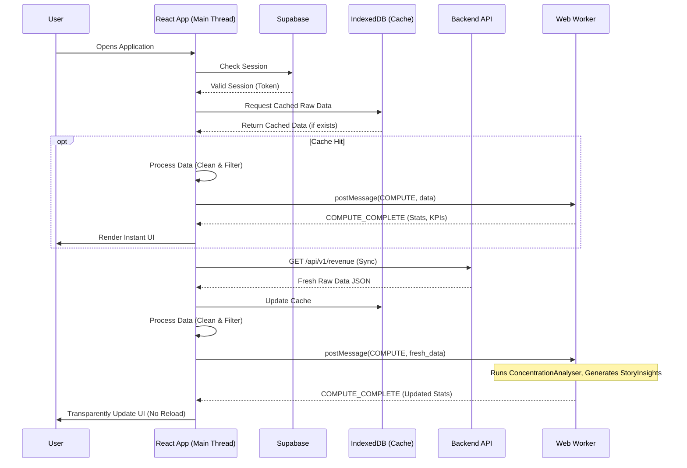

# Grew Analytics: System Architecture & Ontology

This document provides a comprehensive overview of the Grew Analytics platform's architecture, data flow, dependencies, and ontology.

## 1. Folder Responsibility Map

The workspace is structured as a monorepo containing the frontend application, backend API, shared business logic, and infrastructure code.

```text
/
├── apps/
│   ├── api/                   # Node.js/Express backend
│   │   ├── controllers/       # Request handlers (e.g., revenueController)
│   │   ├── repositories/      # Database interaction (PostgreSQL pool)
│   │   ├── routes/            # API endpoint definitions
│   │   └── services/          # Business logic and external API integrations
│   └── web/                   # React/Vite frontend (SPA)
│       ├── public/            # Static assets (favicons, manifest)
│       ├── src/
│       │   ├── assets/        # Custom SVG iconography
│       │   ├── hooks/         # Custom React hooks (e.g., useKeyboardShortcuts)
│       │   ├── modules/       # Feature-based architecture (Auth, Dashboard, Revenue, Shared)
│       │   ├── services/      # Client-side API and IndexedDB caching logic
│       │   └── store/         # Zustand global state management
├── packages/
│   └── shared/                # Shared TypeScript interfaces, logic, and configurations
│       └── src/               # DataSanitizer, ComputeEngine, ColorEngine, MetricFormatter
├── database/                  # Database schema, migrations, and seed data
├── docs/                      # Technical documentation and legacy architectural references
├── infrastructure/            # Terraform/Docker deployment configurations
├── monitoring/                # Logging and metrics (Prometheus/Grafana integration)
└── scripts/                   # Utility scripts for DB testing and chron jobs
```

## 2. System Architecture & Dependency Graph (Mermaid)

The platform utilizes a modular shell architecture on the frontend, supported by a high-performance Express backend and a PostgreSQL database. Authentication is handled via Supabase.

```mermaid
graph TD
    %% Core Infrastructure
    Client[Browser Client]
    Supabase[Supabase Auth]
    DB[(PostgreSQL DB)]
    Cache[(IndexedDB Local Cache)]

    %% Frontend Apps
    subgraph Frontend [React SPA (apps/web)]
        Shell[Unified Shell & Navigation]
        Store[Zustand State]
        Worker[Web Worker Thread]
        RevApp[Revenue Hub Module]
        InvApp[Inventory Module]
    end

    %% Backend Apps
    subgraph Backend [Node.js API (apps/api)]
        Express[Express Router]
        RevCtrl[Revenue Controller]
        Repo[Postgres Repository]
    end

    %% Shared Library
    Shared[[@revenue/shared]]

    %% Connections
    Client <-->|HTTPS / UI Interactions| Shell
    Shell <-->|Auth Tokens| Supabase
    Shell <-->|REST API| Express
    Shell <-->|Read/Write| Cache
    Shell <-->|State/Filters| Store
    Store <-->|Offload heavy compute| Worker
    
    Shell --> RevApp
    Shell --> InvApp

    Express --> RevCtrl
    RevCtrl --> Repo
    Repo <-->|SQL Queries| DB

    %% Shared Dependencies
    RevApp -.->|Imports| Shared
    Worker -.->|Uses ComputeEngine| Shared
    RevCtrl -.->|Uses Interfaces| Shared
```

## 3. Call Graph: Application Boot Sequence

The boot sequence is designed for near-instant rendering using IndexedDB, followed by a background synchronization with the live database.



## 4. Module Dependency Graph

This graph illustrates the internal dependencies within the `@revenue/web` workspace.

```mermaid
graph LR
    A[main.tsx] --> B[App.tsx]
    B --> C[AuthLayer]
    B --> D[GlobalSidebar]
    B --> E[TopNavigationRail]
    B --> F[KpiGrid]
    B --> G[RevenueMatrix]
    B --> H[VelocityChart]
    B --> I[DetailLists]
    B --> J[ExecutiveStories]
    
    F --> Store[useStore]
    G --> Store
    H --> Store
    I --> Store
    
    F --> Shared[@revenue/shared]
    G --> Shared
    H --> Shared
    
    B --> Worker[worker.ts]
    Worker --> Shared
```

## 5. Domain Ontology (Data Models)

The ontology defines the core vocabulary and structure of the data processed by the analytical engine.

### `RevenueRow` (Atomic Transaction)
The most granular level of data representing a single sales record.
*   **Properties:** `date` (Date), `monthIdx` (number), `year` (number), `monthKey` (string), `val` (number - Amount), `qty` (number - Quantity), `mw` (number - Megawatts), `unitPrice` (number), `segment` (string), `salesHead` (string), `customer` (string), `wp` (string - SKU/Watt-Peak), `isPending` (boolean).

### `FilterConfig` (Global State Bounds)
Defines the parameters used to slice and dice the `RevenueRow` dataset.
*   **Properties:** `segment` (string[]), `metric` ('Amount' | 'MW' | 'Qty'), `velocityMode` ('Daily' | 'Weekly' | 'Monthly' | 'Quarterly'), `startDate` (string), `endDate` (string), `excludedSeries` (Set<string>), `pendingOnly` (boolean).

### `KPIStats` (Aggregated Performance)
High-level pacing metrics generated for the active period.
*   **Properties:** `periodSales` (number), `mtd` (Month-to-Date), `qtd` (Quarter-to-Date), `ytd` (Year-to-Date), `pending` (number), and their respective breakdown dictionaries (`mtdBreakdown`, etc.) for charting.

### `EntitySummary` (List Models)
Aggregated totals grouped by a specific dimension (e.g., Customer, Sales Head, SKU).
*   **Properties:** `n` (Name string), `v` (Total Value), `plotKeys` (Dictionary of SKUs to values for stacked bar charts), `comps` (Array of related sub-entities).

### `Insight` / `StoryInsight`
Actionable intelligence generated heuristically from the data.
*   **Properties:** `t` (Type: 'success' | 'risk' | 'strategic'), `l` (Label), `txt` (Narrative text), `cta` (Call to Action object).
